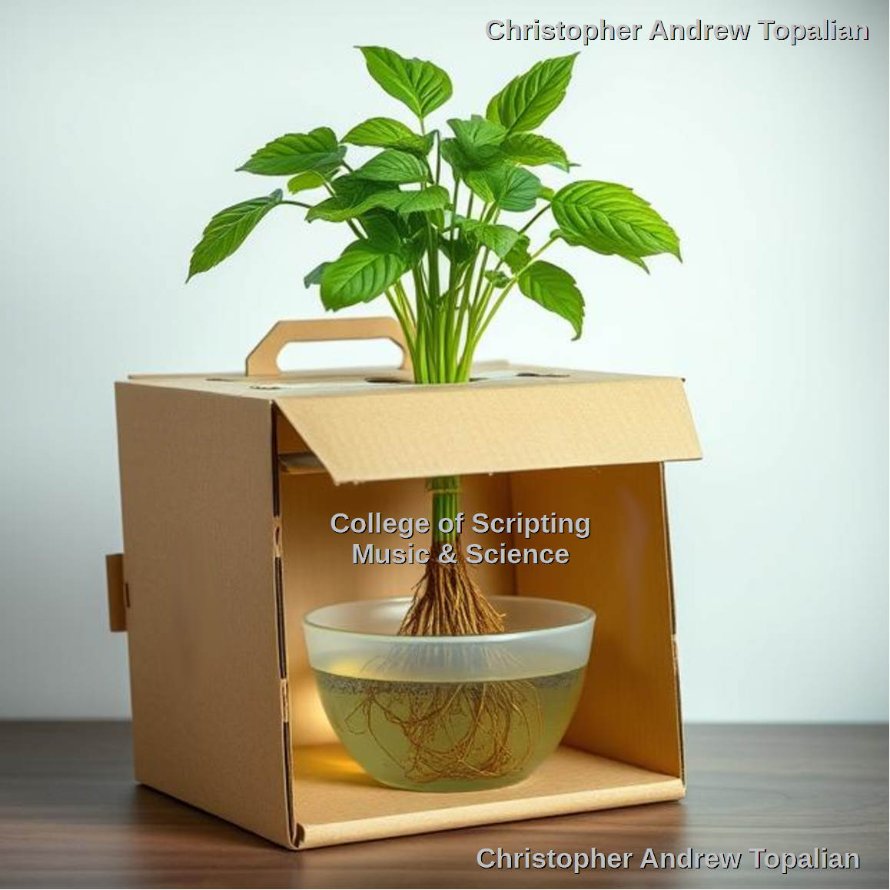
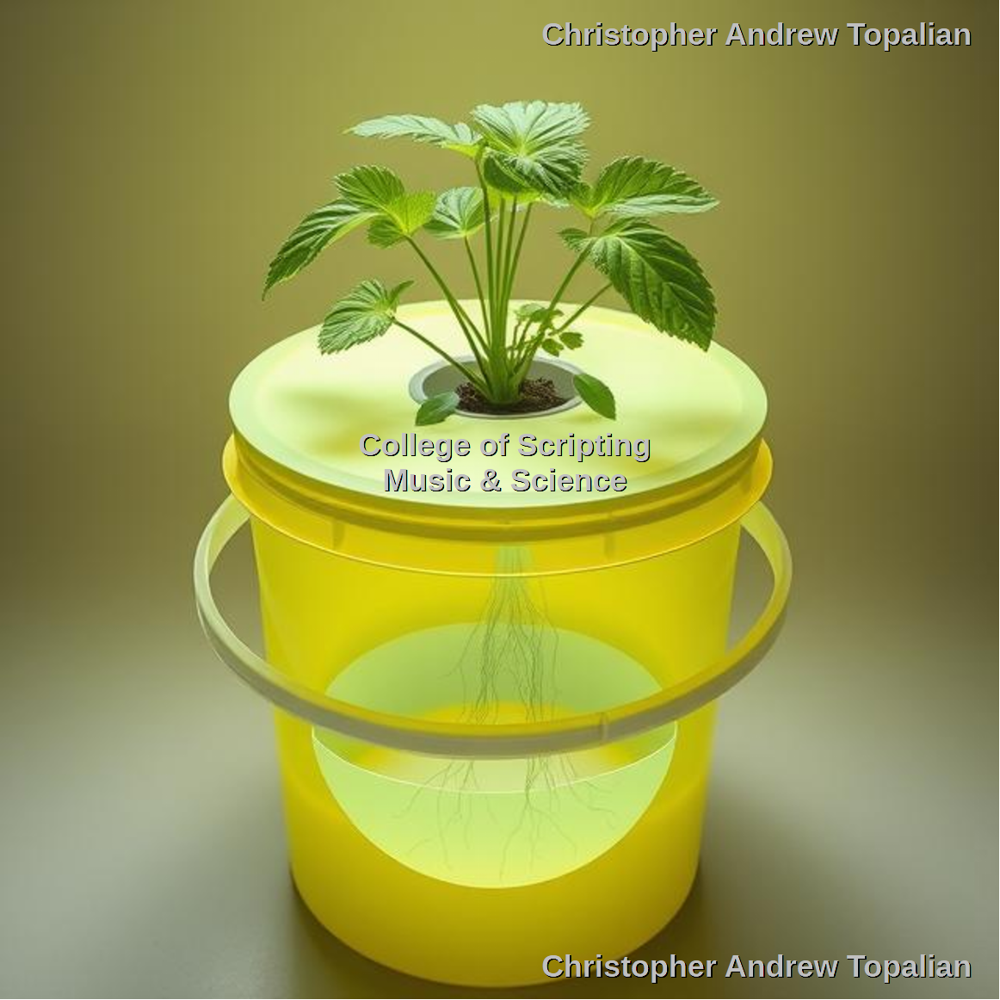
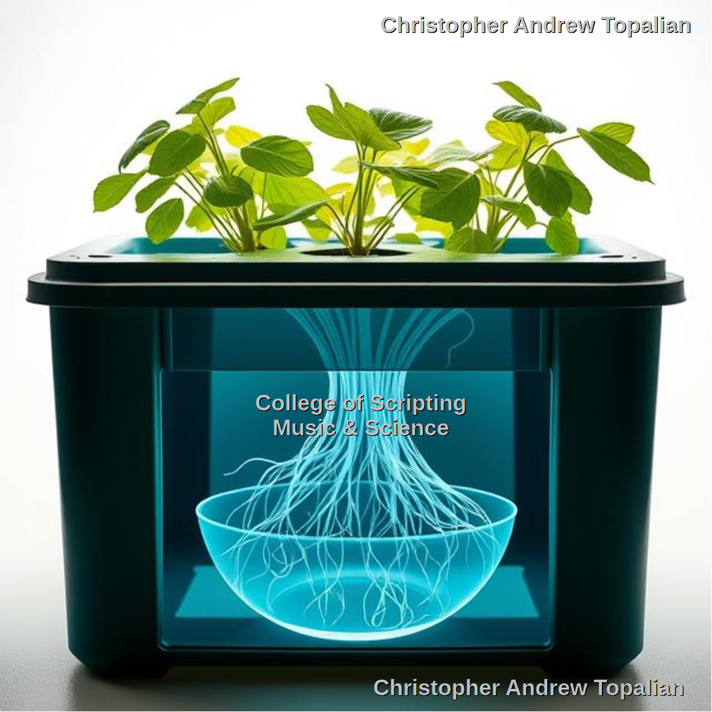
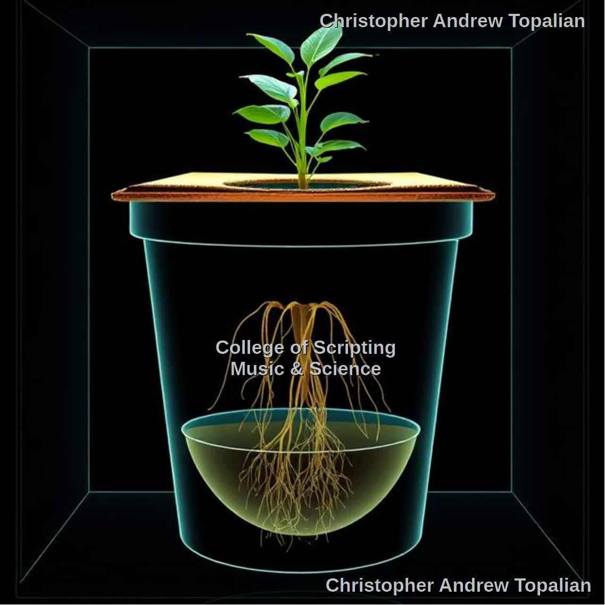
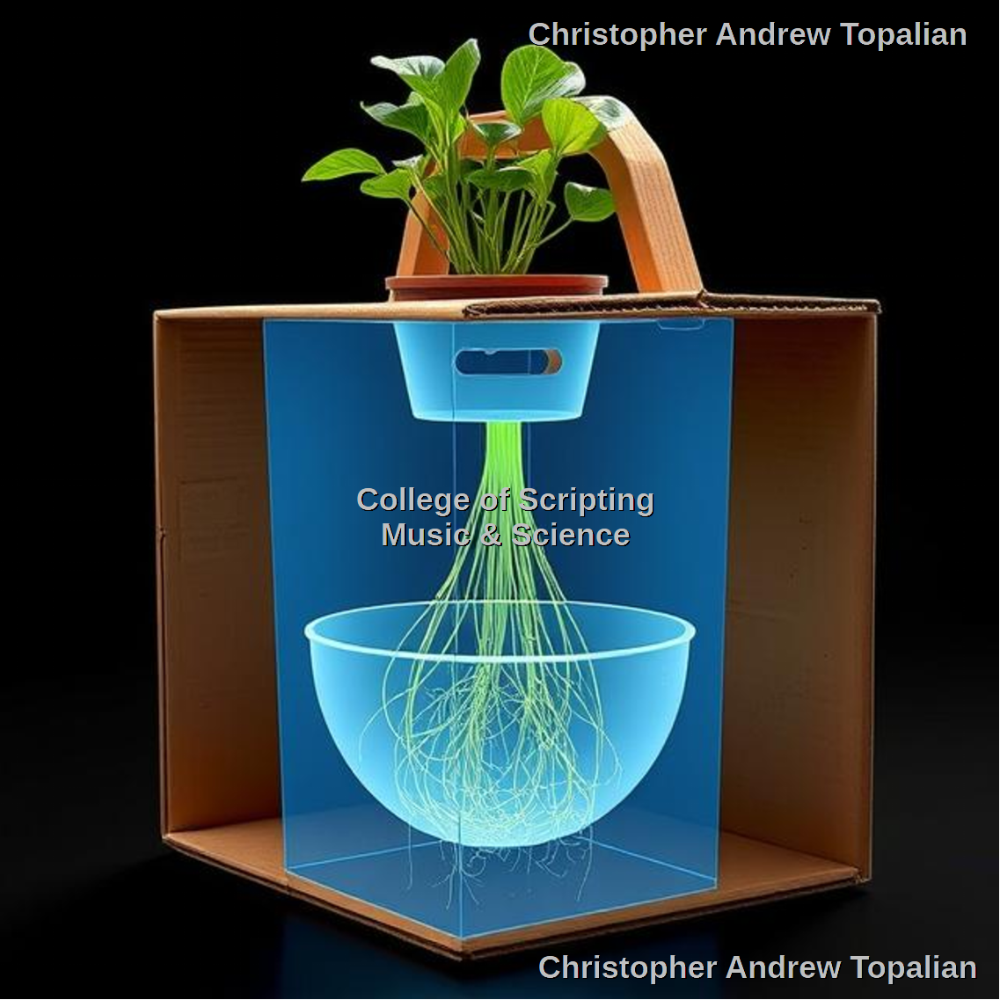

# CATopalian_Organic_Hydroponics
We make hydro easy. Check it out. I promise.

---

# LESSON ONE:
1. Do NOT do Hydro inside without adequate ventillation!

This is more obvious with organics, but listen, the same issue is happening with the chemical versions. At no time should a person grow any plants in a house without proper ventillation going 24/7!

2. The nitrification tower will NOT nitrify in cold weather and instead will result in only ammonium that will burn the roots and plant leafs.

3. Without compost the nitrification tower is almost guranteed to fail and not nitrify, due to a lack of nitrifying bacteria, from a lack of compost!.

4. Do NOT put worm castings in the water or it will smell horrible!

# Principles of Hydroponics
> 1. [Algae](src/principles_of_hydroponics/algae/algae.md)  
> We must block all light from hitting the nutrient solution or else Algae will destroy the roots fast!

> 2. [Temperature](src/principles_of_hydroponics/temperature/temperature.md)  
> The plants REQUIRE a cool temperature for hydro to work efficiently!

---

# Systems

  

[Cardboard box on Side](src/method/cardboard_box/cardboard_box_on_side/cardboard_box_on_side.md)  

---

  

[Plastic Bucket with Lid](src/method/plastic_bucket/plastic_bucket_with_lid/plastic_bucket_with_lid.md)  

---

  

[Plastic Tote with Lid](src/method/plastic_tote/plastic_tote_with_lid/plastic_tote_with_lid.md)  

---

  

[Plastic Flower Pot](src/method/plastic_flower_pot/plastic_flower_pot.md)  

---

# Plant Collars
[Plant Collars](src/method/plant_collar/plant_collar.md)  

---

  

---

This is the CATopalian Hydroponics System.

We do NOT need a bubbler.

We do NOT need 5 gallon buckets to hold water.

Instead we can use any bowl for containing the liquid and we keep the roots healthy by changing out the nutrient solution bowl as often as needed.

Because the bowl is white or clear we can see when the water is dirty and thus when it needs changing.

When the water is dirty we change the water quickly because it is a bowl system that is very small and easy to change out.

---

> # 

---

# [Cardboard Box Method Step by Step Instructions](src/step_by_step_instructions/cardboard_box_step_by_step.md)  

---

# Organic Nutrient Solutions

[Urine Nutrient Solution](src/method/nutrient_solution/urine_nutrient_solution/urine_nutrient_solution.md)  

[Phosphateification Tower](src/method/nutrient_solution/urine_nutrient_solution/phosphorous/struvite/crystallizing_struvite_to_concentrate_phosphorous.md)  

---

## Organic Plant Fertilizer
### Microbial Nitrate Extractor
* 5 gallon bucket
* Drill holes at bottom
* Fill with soil
* Every day pour your urine
* After 7 to 10 days run water through
* Catch runoff in bowl
* Use the Water immediately on plants as fertilizer OR
* Let the water Evaporate if you want concentrated powder version.

It's Sodium Free Organic Plant Fertilizer!  

It's Hydroponics made easy!

---

//----//

// Dedicated to God the Father  
// All Rights Reserved Christopher Andrew Topalian Copyright 2000-2025  
// https://github.com/ChristopherTopalian  
// https://github.com/ChristopherAndrewTopalian  
// https://sites.google.com/view/CollegeOfScripting  

