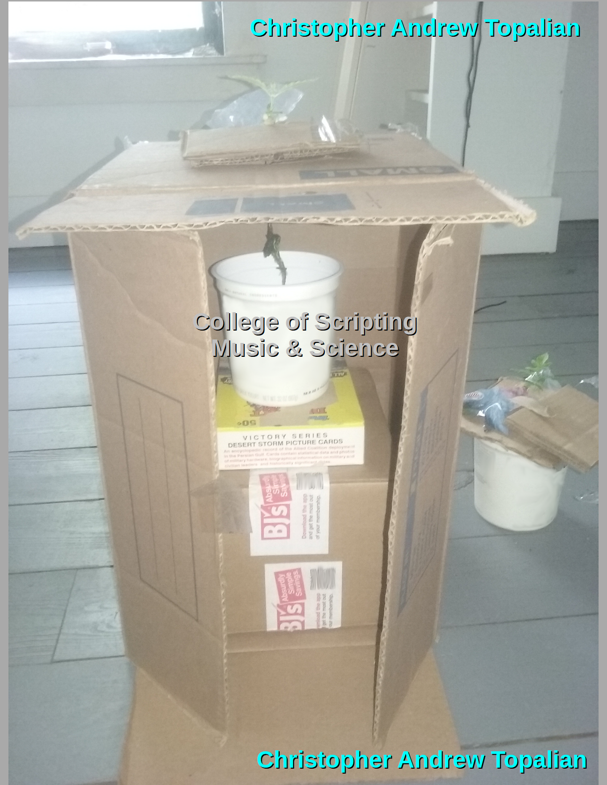
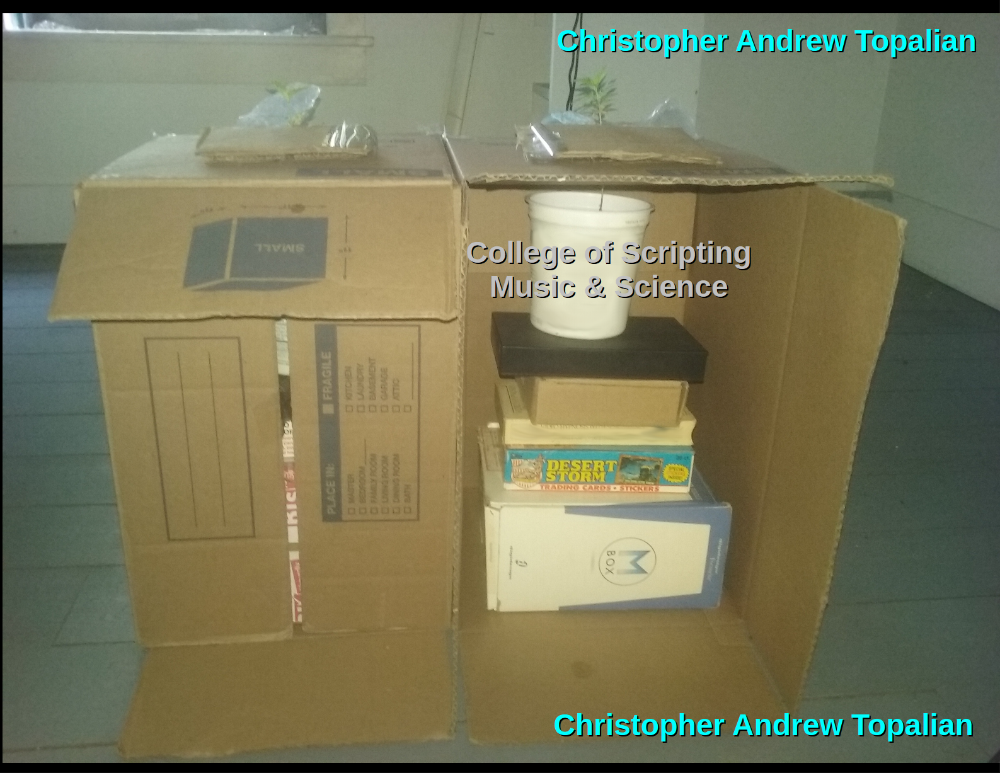
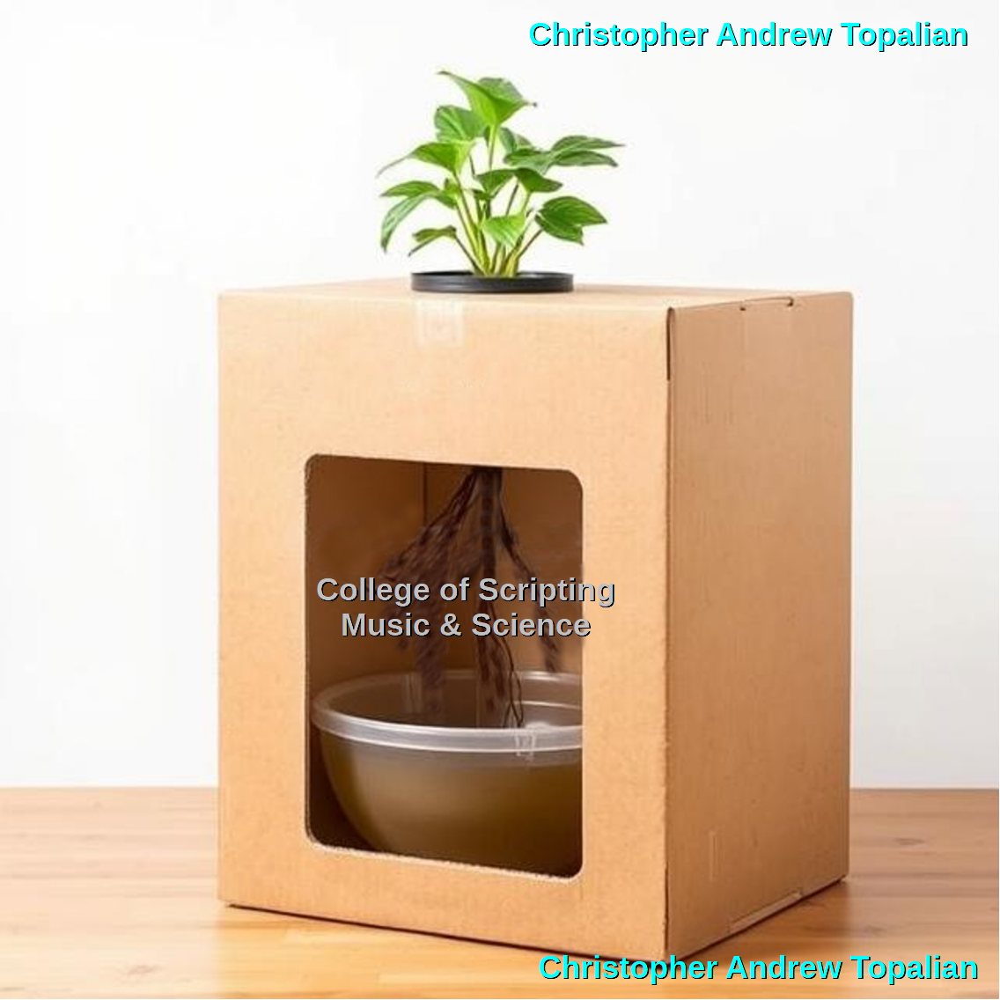

# Cardboard Box on Side

  

  

  
The seedling shown in this image had been damaged from previous algae from other experiments.  

I like this method shown above, because we can remove the rectangle objects one by one as the roots descend downward.
This grows very big plants very easily and very quickly and with very little amounts of water.

---

  

Here we see two carboard boxes next to each other, each with their own single plant at the top, with their roots descending down into the cardboard box to find the nutrient solution in the yogurt container.  

> #

---

  

A small home depot cardboard box on its side is very tall and blocks all light. On the floor where one side sits, we place our gallon jug of water and organic solution.

The plant we put on top where the box handle is and the roots descend into the gallon container that is on the floor in the box.

---

Now, importantly, we start the plant in a smaller container first, to train the roots to be about 10" long and would already have air roots developed.

---

The idea of using the cardboard box is that it will trick the roots into thinking that the space is massive, so it will grow very large.

---

We can place a bigger container of water and organic solution on the bottom instead of a gallon jug. 

---

The organic nutrient solution is very easy:
1:100 ratio of urine to water.

---

If we don't have one large container to put the organic solution in, we can use multiple smaller containers.

---

The gallon jugs make it very easy to change the solution out with another gallon jug that we prepare.

In this way our organic nutritent solution is always fresh and never causing the roots any kind of bacterial burden.

---

By using the gallon jugs we make it easy to change the nutritent solution and thus ensure a better chance at success.

---

//----//

// Dedicated to God the Father  
// All Rights Reserved Christopher Andrew Topalian Copyright 2000-2025  
// https://github.com/ChristopherTopalian  
// https://github.com/ChristopherAndrewTopalian  
// https://sites.google.com/view/CollegeOfScripting  

