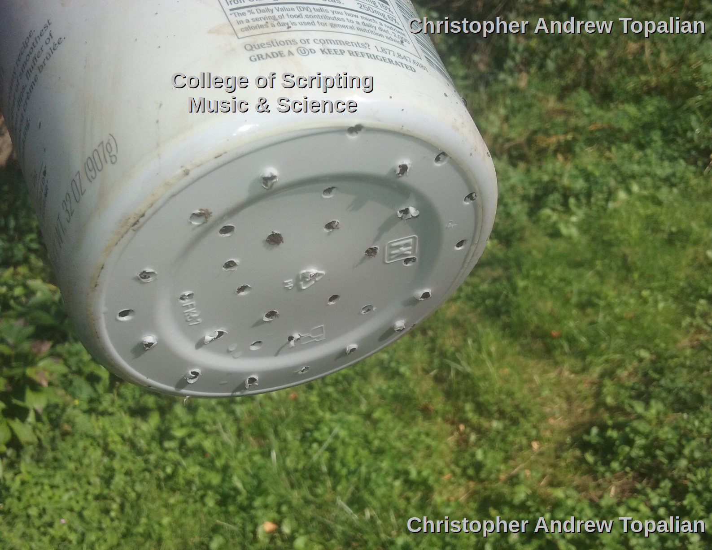
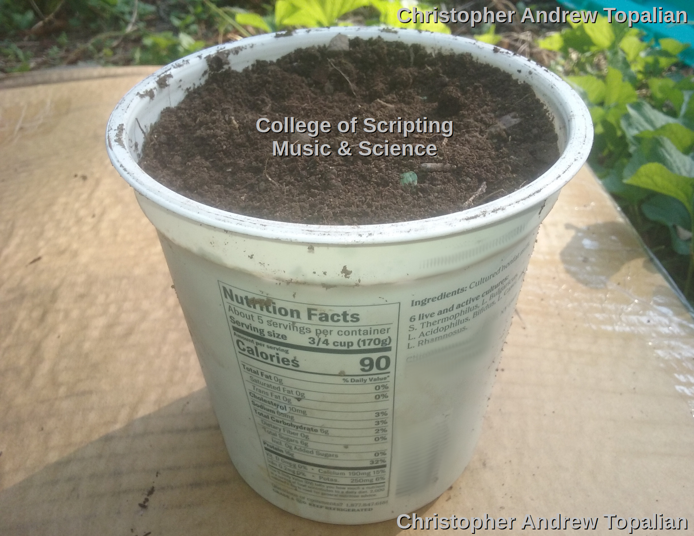
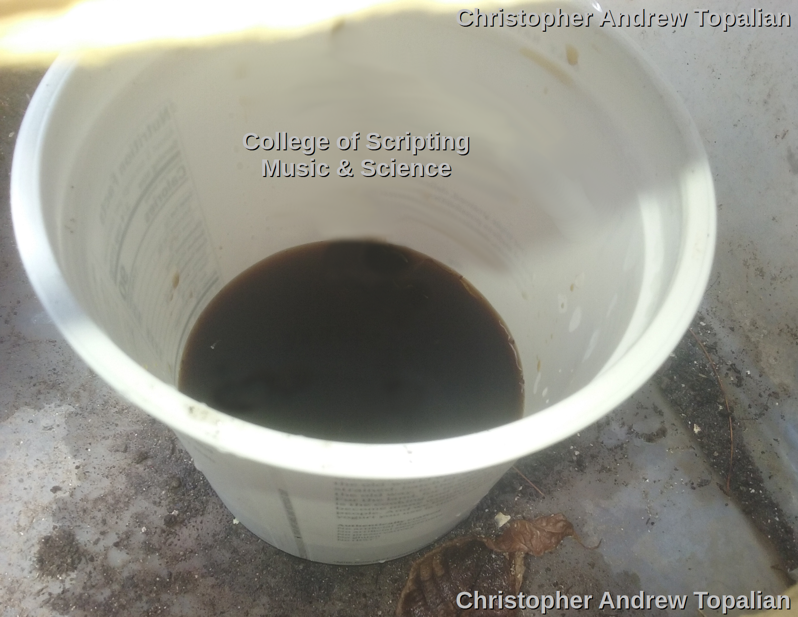

# Nitrification Tower - a

The Nitrification tower works very well to utilize microbes to process the urine into usable low sodium high nitrate fertilizer.

---

  

  

  

---

## Experiment Parameters:
* Using a 32 Oz Container of Soil with Holes in Bottom of Container
* Add 300 Grams of Urine Per day for 4 days
* Let it sit for 7 days
* Pour 500ml of Water through and Collect it in a Container

The result is 'BLACK TEA'.

1:50 Ratio appears to be working well in the Hydroponic System.

---

//----//

// Dedicated to God the Father  
// All Rights Reserved Christopher Andrew Topalian Copyright 2000-2025  
// https://github.com/ChristopherTopalian  
// https://github.com/ChristopherAndrewTopalian  
// https://sites.google.com/view/CollegeOfScripting  

