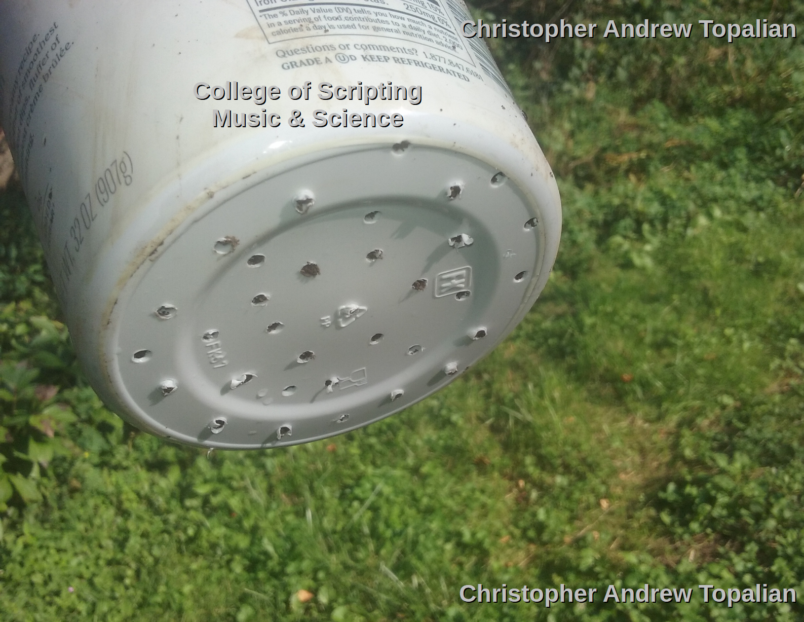
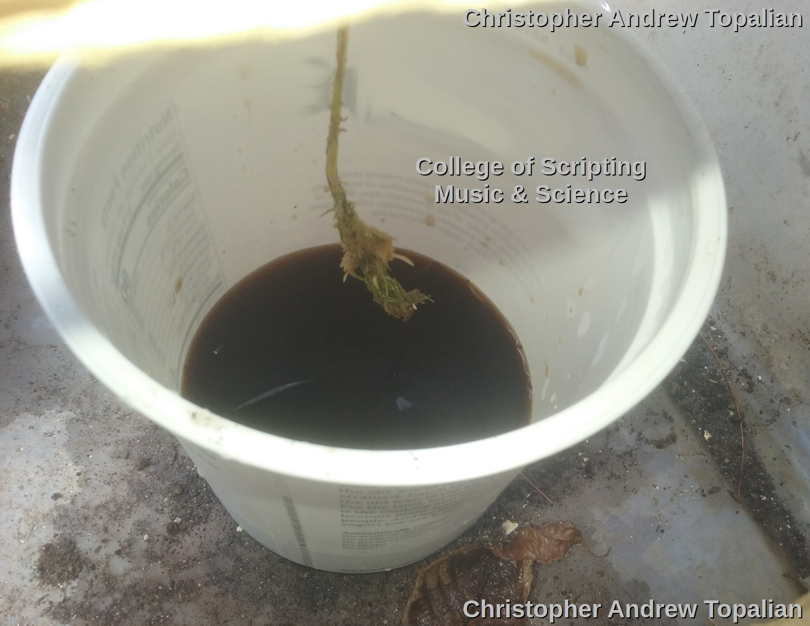

# Soil Microbe Processing - H

## 🌱 Yogurt Container Nitrate Reactor (Mini Soil Column)

  

  

### Small-Scale Fertilizer Maker for Evaporation or Direct Use

---

### 🧪 Purpose

To create a **compact system** that converts **urine to nitrate-rich, low-sodium plant fertilizer** using microbial action in soil — ideal for:

* Small spaces
* Indoor windows (with fan/ventilation)
* Daily micro-batches
* Lightweight prepping or Ice Age survival
* Teaching and scientific demonstrations

---

### 🧰 Materials

* 1 large **yogurt container** (750g or 1L)
* Pin or drill (⅛” or 3mm drill bit)
* **Rich soil** (preferably with humus and microbial life)
* Catch cup or saucer
* Optional: cheesecloth or fine mesh over drain holes
* Optional: coffee filter paper between soil layers to hold shape
* Optional: plastic wrap over top for evaporation/condensation capture

---

### 🔧 Construction Instructions

1. **Drill 3 to 5 holes** in the bottom for drainage.
2. **Fill the container** with soil to the top, lightly packed.
3. Let sit **outdoors or by a window** to ensure microbial survival.
4. Place a bowl or container underneath to catch leachate (runoff).

---

### 🧫 Daily Protocol

* Pour **250–500 mL urine** onto the soil daily.
* Do this **for 7 to 10 days** (longer = more concentrated).
* **Do not flush yet.** Allow microbes time to nitrify.

---

### Waiting Phase
* After the day 10, stop adding urine to the soil.  
* Allow the Microbes 5 days to do their work.  

### 💧 Flushing Phase
1. Pour **500–750 mL of clean water** through the container.
2. Catch the runoff. This is your **fertilizer leachate**.
3. Optional: **Repeat flush 2 more times** to get all usable nitrate.

🧪 This runoff is **nitrate-rich, low-sodium, and safe for hydroponics** or foliar spray.

---

### 🔥 Evaporation to Powder (Optional)

If you want to **store** the fertilizer as **crystals or powder**:

* Pour collected runoff into a glass tray or bowl.
* Leave in sun (or next to fire or wood stove).
* After 3–5 days (depending on humidity), you’ll see **white or yellowish crystals**.
* Scrape and store in a **dry, airtight jar**.

⛏ **Yield estimate**:
From 10 days of 500 mL/day:

* \~150–300 mL per flush
* 3 flushes = \~450–750 mL
* \~4–6 grams of **dried nitrate fertilizer** (mostly potassium nitrate)

> This is enough for **many hydroponic feedings** due to its strength.

---

### ⚗️ What About Sodium?

💡 Soil naturally **binds sodium** ions due to its negative charge, especially in **clay and humus-rich soils**.
Even in a yogurt container, most sodium will **cling to the soil particles** and **not pass into the runoff**, especially with the slow 10-day microbial soak.

---

### 🌿 Bonus: Add Bone Meal?

Yes — bone meal or Epsom salt can be added **after runoff is collected**:

* **Bone Meal**: 1–2 grams per liter for phosphorus
* **Epsom Salt**: 1 gram per liter for magnesium + sulfur

---

### 🏠 Indoor Use Warning

Even at small scale:

* There **will** be **ammonia fumes** for the first few days.
* Ensure **ventilation** or use it **outside** or in a shed.
* Use **baking soda in the catch tray** to neutralize smells if needed.

---

### 🔥 Final Notes

* This method **does not produce potassium nitrate crystals directly** unless:

  * You evaporate the nitrate-rich runoff water.
  * You allow full nitrification (10+ days feeding + 3 flushes).
* It will NOT reach full nitrate levels without enough time or soil volume.
* **Yield can be scaled up** by running multiple yogurt containers in parallel.

---

# Experiment:
## Parameters
* 32 Oz of Soil
* 300 grams of Urine Added once a day  
* Let it sit for 7 days
* Pour 500ml of water and collect the 'black tea' liquid.  
* Testing applying it as a nutritent solution for hydroponic Plant 2.
* No dilution was used.  
* Plant 2 has major algae issue from being outside in incorrect container  

Goal: Goal is to see if, even with algae damage this plant will show signs of growth from the pure undiluted nutrient solution, which should consist of very low sodium potassium nitrate water.  

  

# Experiment Results
* Day 001 - Good Results so far. Plant looks healthy.

//----//

// Dedicated to God the Father  
// All Rights Reserved Christopher Andrew Topalian Copyright 2000-2025  
// https://github.com/ChristopherTopalian  
// https://github.com/ChristopherAndrewTopalian  
// https://sites.google.com/view/CollegeOfScripting  

