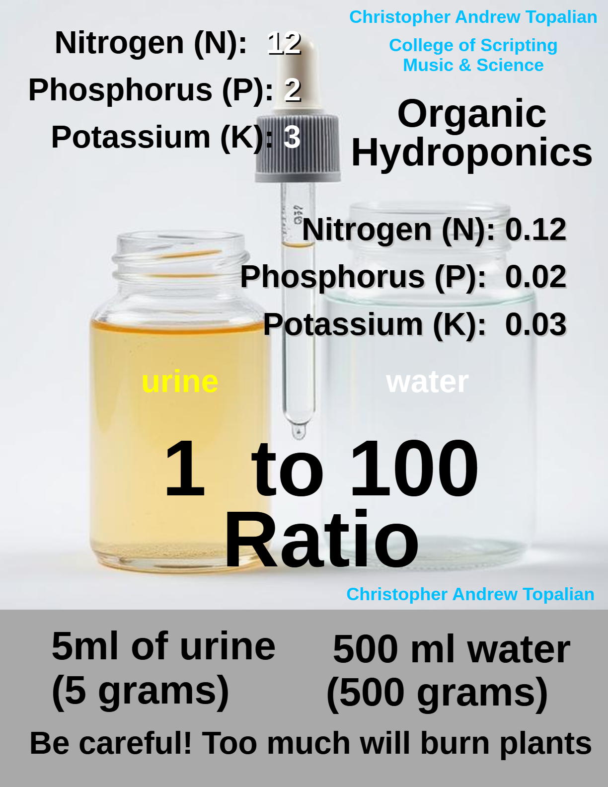
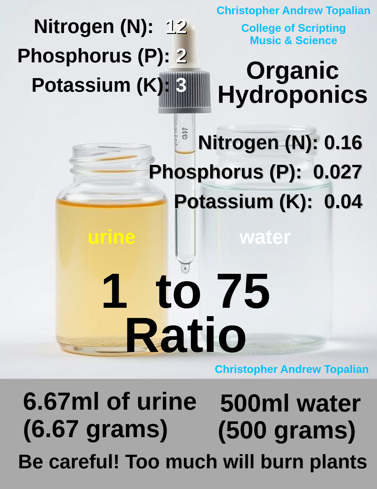
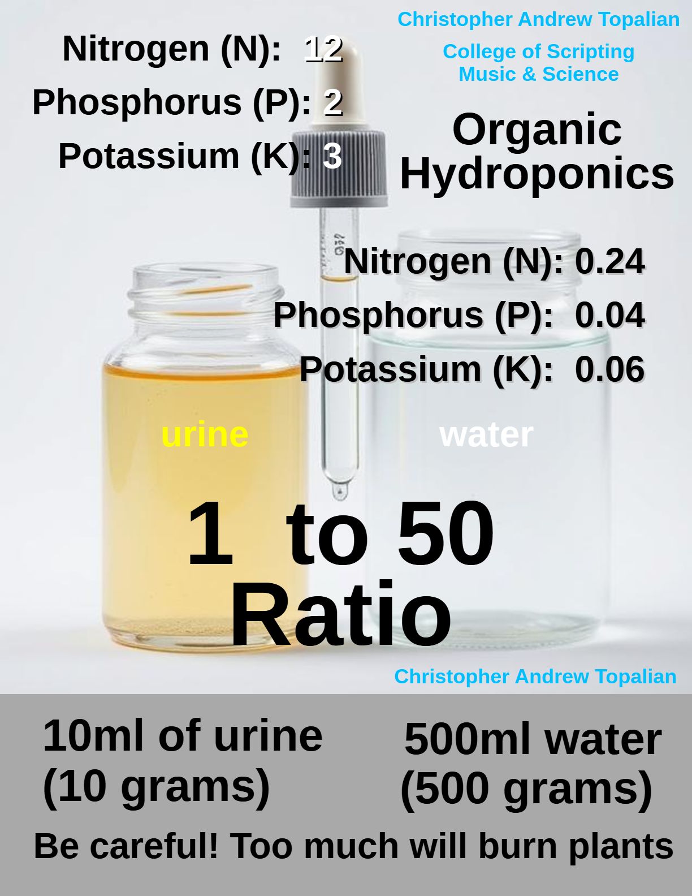
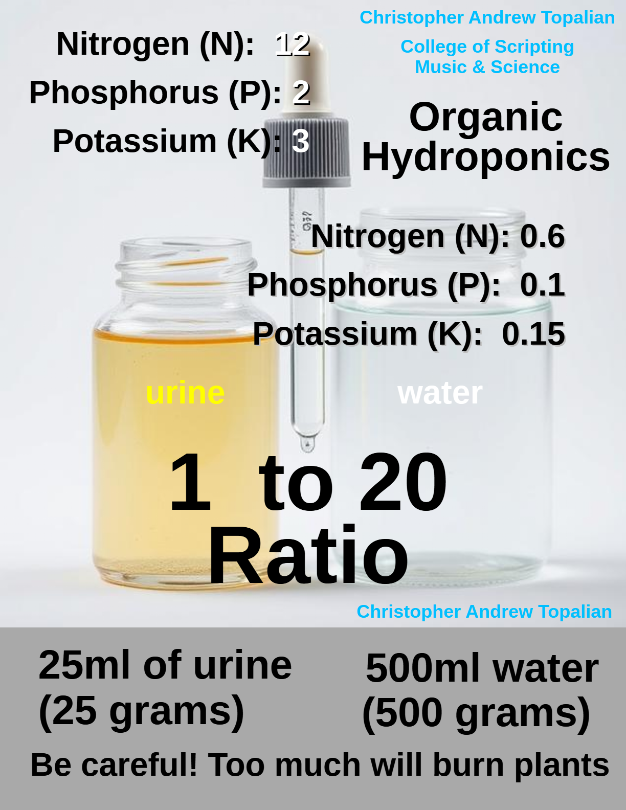
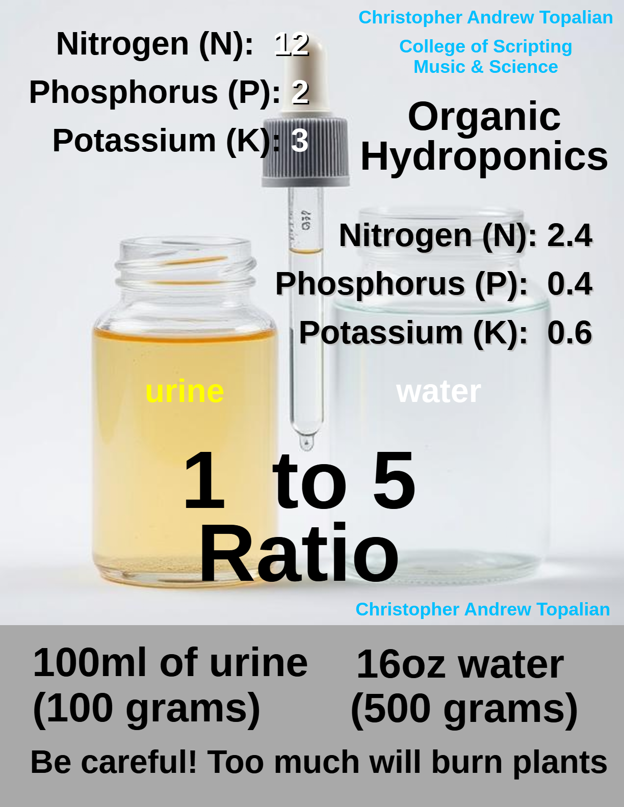

# Urine Nutrient Solution

Urine is natural organic fertilizer for plants.

---

| Dilution Ratio | Urine (g) | Water (g) | Total (g) | NPK (Approx)     |
|----------------|-----------|-----------|-----------|------------------|
| 1:500          | 1         | 500       | 501       | 0.024, 0.004, 0.006 |
| 1:200          | 2.5       | 500       | 502.5     | 0.06, 0.01, 0.015  |
| 1:100          | 5         | 500       | 505       | 0.12, 0.02, 0.03   |
| 1:75           | 6.67      | 500       | 506.67    | 0.16, 0.027, 0.04  |
| 1:50           | 10        | 500       | 510       | 0.24, 0.04, 0.06   |
| 1:20           | 25        | 500       | 525       | 0.6, 0.1, 0.15     |
| 1:5            | 100       | 500       | 600       | 2.4, 0.4, 0.6      |

---

> #

# Element Amounts in Urine at 1:75 Ratio

| Element       | Symbol | Approx. mg/L in Urine | Scaled mg/L at 1:75 | Role in Plant Growth                   |
|---------------|--------|------------------------|----------------------|----------------------------------------|
| Nitrogen      | N      | 12,000                 | 160                  | leaf/stem growth, chlorophyll          |
| Phosphorus    | P      | 2,000                  | 26.7                 | energy transfer, root development      |
| Potassium     | K      | 3,000                  | 40                   | water regulation, enzyme activation    |
| Calcium       | Ca     | 230                    | 3.07                 | cell wall structure, root health       |
| Magnesium     | Mg     | 100                    | 1.33                 | photosynthesis, enzyme cofactor        |
| Sulfur        | S      | 90                     | 1.2                  | protein synthesis, flavor compounds    |
| Sodium        | Na     | 4,000                  | 53.3                 | not essential but tolerated in small doses |
| Chloride      | Cl     | 6,000                  | 80                   | osmosis and charge balance             |
| Iron          | Fe     | 1                      | 0.013                | chlorophyll synthesis                  |
| Manganese     | Mn     | 0.3                    | 0.004                | enzyme activation                      |
| Zinc          | Zn     | 0.5                    | 0.007                | growth hormone production              |
| Copper        | Cu     | 0.1                    | 0.0013               | photosynthesis, lignin synthesis       |
| Boron         | B      | 0.3                    | 0.004                | cell wall formation, flowering         |
| Molybdenum    | Mo     | 0.01                   | 0.00013              | nitrogen fixation, enzyme function     |

---

> #

# 1:500 Ratio is likely too weak for many plants
To give an idea of the ratio of how little amount of urine to water is being used, let's imagine we are filling a container the size of a 32 oz yogurt container that is half full.

1 eye dropper full of 1 ml of urine is a very small amount in that 16 oz of water, which is about 500 grams of water.

This is about 1:500 ratio.

If you add too much nitrogen it may cause the leafs to curl from nitrogen burn.

  

---

# 1:100 Ratio
3.3ml to every 500g of water is npk of 0.12, 0.02, 0.03  

So in a 32 oz yogurt container, we would have 500g of water, which is about half of the container and we would use 3 eyedroppers full of urine plus .3 more.

  

---

# 1:75 Ratio
NPK = 0.16 - 0.027 - 0.04
  

---

# 1:50 Ratio
NPK = 0.24 - 0.04 - 0.06
  

---

# 1:20 Ratio
NPK = 0.6 - 0.1 - 0.15
  

---

# 1:5 Ratio
All plants are different. This ratio may burn some plants instantly! Be careful. Start with lower ratios first!
But, if we were shooting for a good npk, we would use the 1:5 ratio to achieve an npk of 2.4, 0.4, 0.6

1:5 ratio would be about 100ml (100 grams of urine) to 500ml (500 grams) of water.

  

---

Remember that urine is very powerful plant fertilizer.

---

# Application
Fresh Urine is easy to use for plants, because the ammonia in it is usually constant and the urine itself does not smell bad.

If you cut a water bottle at the top and pee into it and then collect 3 eye droppers of urine, you can then put that natural plant fertilizer into the yogurt container that has 500 grams of water.

By utilizing fresh urine we have an easy way to always use a consistant amount of ammonia each time we change the nutrient bowl in our hydroponic system.  

//----//

// Dedicated to God the Father  
// All Rights Reserved Christopher Andrew Topalian Copyright 2000-2025  
// https://github.com/ChristopherTopalian  
// https://github.com/ChristopherAndrewTopalian  
// https://sites.google.com/view/CollegeOfScripting  

