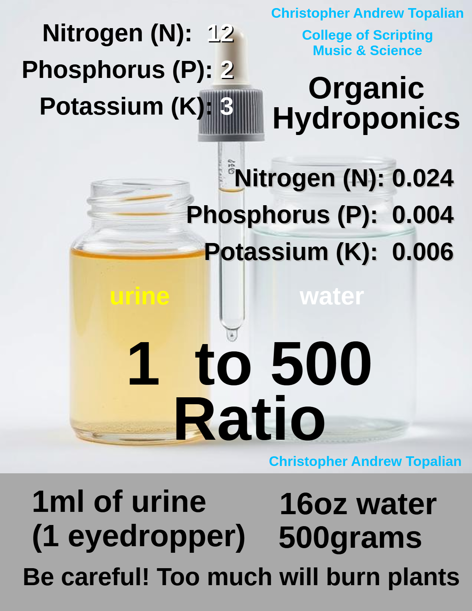

# Urine Nutrient Solution

  

Urine is natural organic fertilizer for plants.

---

# 1:500 Ratio
To give an idea of the ratio of how little amount of urine to water is being used, let's imagine we are filling a container the size of a 32 oz yogurt container that is half full.

1 eye dropper full of 1 ml of urine is a very small amount in that 16 oz of water, which is about 500 grams of water.

This is about 1:500 ratio.

If you add more it may cause the leafs to curl from nitrogen burn.

Remember that urine is very powerful plant fertilizer.

---

//----//

// Dedicated to God the Father  
// All Rights Reserved Christopher Andrew Topalian Copyright 2000-2025  
// https://github.com/ChristopherTopalian  
// https://github.com/ChristopherAndrewTopalian  
// https://sites.google.com/view/CollegeOfScripting  

