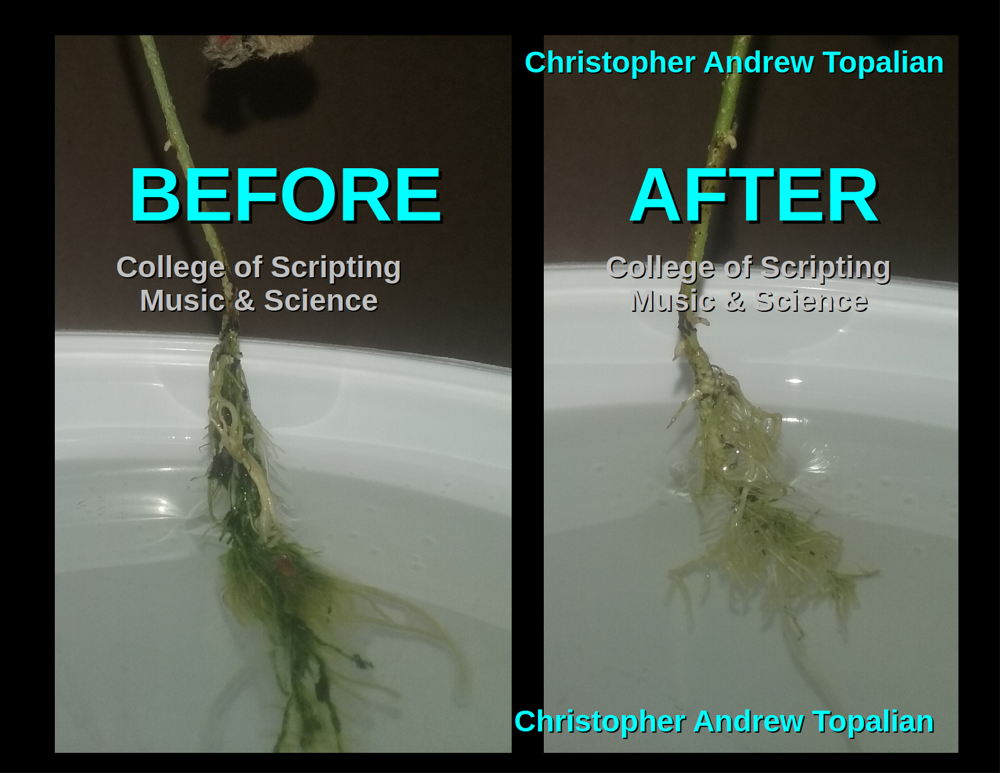

# Algae

Algae quickly destroys all roots!

You must never have algae or it will destroy the plants!

Block ALL light from entering the nutrient solution water!

If you let algae grow, the roots will be totally taken over and destroyed!

Always change the water immediately if you see any algae!

---

# Algae Removal
Removing algae is super easy.
1. Cut a water bottle at the top.
2. 400 Grams of Water to soak the roots in
3. 4 Grams of Hydrogen Peroxide in the water
4. Soak the roots for 20 minutes.
5. Take another water bottle and fill it with water. Put the cap on. Poke a hole in the cap with a sharp screw. 
We use this water bottle to JET the roots clean with water! It works excellent! The roots go from green to white with pretty much one bottle of water for seedlings! We can use an empty yogurt container and place the roots against it as we JET water into the roots to clean them.

---

---

//----//

// Dedicated to God the Father  
// All Rights Reserved Christopher Andrew Topalian Copyright 2000-2025  
// https://github.com/ChristopherTopalian  
// https://github.com/ChristopherAndrewTopalian  
// https://sites.google.com/view/CollegeOfScripting  

